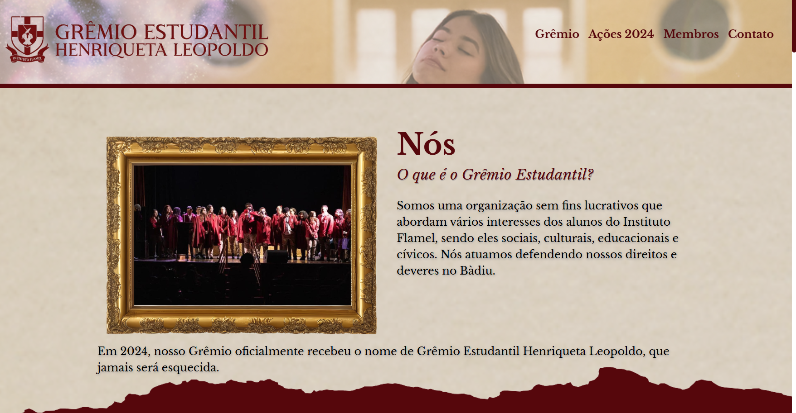

# Site institucional Grêmio Henriqueta Leopoldo

> Projeto de site institucional desenvolvido para um evento literário imersivo.

### Features

O projeto está finalizado e entregue com as seguintes funcionalidades:

- [x] Descrição do evento 
- [x] Divulgação das ações realizadas no evento
- [x] Responsividade para dispositivos móveis, desktops e notebooks

## 🤝 Colaboradores

Construção do escopo, design e programação do site por:

<table>
  <tr>
    <td align="center">
         
        
          <b>Wesley Bueno</b>
        
    </td>
  </tr>
</table>

## 📝 Licença

Esse projeto está sob licença. Todos os direitos são reservados à Escola de Magia e Bruxaria do Brasil. Inspirado no universo da escritora Vanessa Godoy.